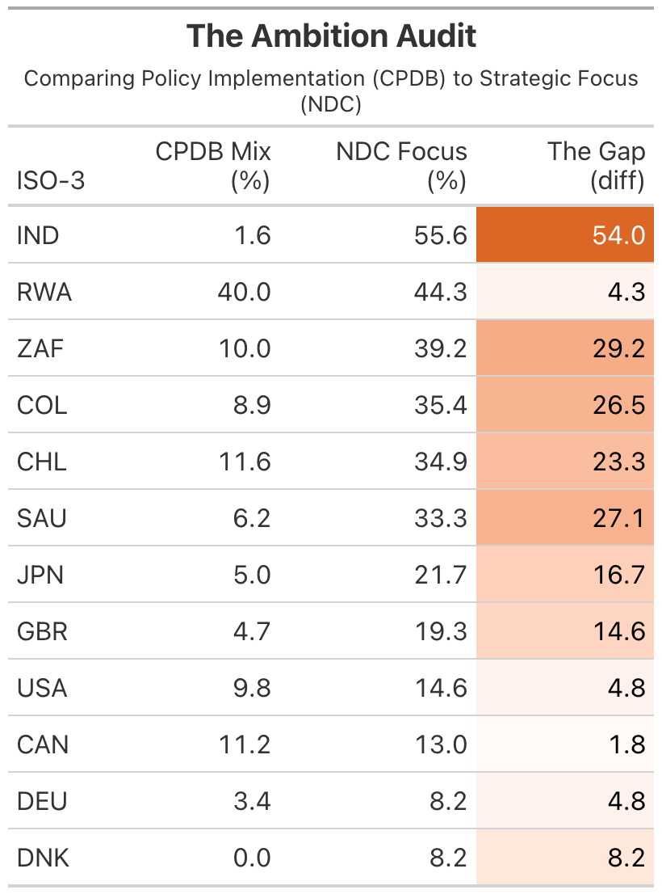

```{r "knitr config", include=FALSE}
# Chunk 1: JUST SET THE DIRECTORY
# This must be its own chunk with no other code
library(knitr)
# This finds your project root automatically
knitr::opts_knit$set(root.dir = rprojroot::find_rstudio_root_file())
```


```{r setup, include=FALSE}
# Load libraries and runmaster pipeline
# Make sure main.R is in the project root (one level up)


library(here)
source(here("main.R"))

```

# Introduction 

Climate policy conversations have historically focused on the mitigation of climate change. However, the increasing frequency and severity of climate impacts has increased the importance of adaptation measures in national policy portfolios. The Paris Agreement (2015) marked a pivotal moment in global climate governance, with its dual focus on mitigation and adaptation.

International climate databases systematically under represent adaptation policies, particularly in the Global South where adaptation is a *survival imperative*. When adaptation is invisible in the data, it becomes invisible in policy debates, climate finance allocation and accountability mechanisms. The lack of comparative global analysis and systematic scrutiny of national adaptation legislation and policies has "hampered the ability to assess progress, identify gaps, and understand effective frameworks" [1, p.10]. This project serves as a digital audit of climate ambition across the selection of countries with an aim to discover if and how countries are shifting towards adaptation adoption. 

The Global North is responsible for the majority of emissions [5] and has more resources to invest in both mitigation and adaptation. Those in the Global South, whilst being less responsible for the acceleration of climate change, are the ones who bear the brunt of it [4]. The comparative analysis of the Global North and Global South is therefore critical to understanding the equity implications of climate policy evolution.

# Research Question

*Has there been a shift towards climate adaptation adoption in policy portfolios after the Paris Agreement, and does this shift differ between Global North and Global South countries?*

**Key Terms:**

- **Climate Policy Portfolio**: The collection of all climate-related policy strategies enacted by a country.
- **Mitigation**: Efforts to reduce or prevent the emission of greenhouse gases to limit global warming.
- **Adaptation**: Efforts to adjust to actual or expected climate change and its effects.

*The terms "Global North" and "Global South" are used as broad categorizations to capture the systemic inequalities in climate responsibility and vulnerability.*

**Boundaries:**

*Temporal Boundary (2013–2025)*

The analysis will focus on the period from 2013 to 2025, allowing us to capture the policy landscape leading up to the Paris Agreement (2015) and the subsequent years. This temporal boundary provides a clear before-and-after comparison to assess the impact of the Paris Agreement on climate policy evolution.

*Country Selection*

The selection of 13 countries (Figure 1) is designed to provide a diverse sample that represents different levels of vulnerability, responsibility, and geographic distribution. 

```{r}
#| echo: false
#| warning: false
#| message: false
#| label: fig-country-selection
#| fig-width: 9
#| fig-height: 6
#| fig-cap: "Selected Countries and their Global Emissions"
print(resilience_labeled_map)
```


*Note: The United States officially left the Paris Agreement (for the second time) on January 27 2026. President Donald Trump has pledged to "remove the nation from the global climate pact." *

# Data Sources

## NewClimate Institute’s Climate Policy Database (CPDB) [2]

The CPDB provides the baseline for actual policy adoption. It offers broad geographic coverage. Its primary limitation is a "Global North bias," where data coverage is stronger. This is a gap addressed by the inclusion of NDC texts. The CPDB's provides structured policy data with policy types (mitigation, adaptation), decision dates and country codes, allowing for a quantitative analysis of policy trends over time. 

*The cleaning and processing of the CPDB data is explained in issue #7.*

## UNFCCC Nationally Determined Contributions (NDCs) [3]

These documents serve as primary statements of government priority. While they allow for a nuanced NLP analysis of "Lexical Hardness" (Hard vs. Soft law) as well as "Adaptation focus" (Percentage of text focused on adaptation), they represent diplomatic pledges rather than tangible enforcement. The plus side of using NDCs is that each country is able to represent themselves as they choose, removing the reliance on third-party data collection and coding which may be biased or incomplete, particularly for the Global South.

*The collection and processing of the NDCs is explained in issue #8.*

## ND-GAIN Index (Resilience Benchmarking) [4]

The ND-GAIN Index provides the context of necessity. The ND-GAIN scores are a composition of vulnerability and readiness indicators. While the Vulnerability score measures physical exposure, the overall Index balances this against a country’s Readiness (its economic, social, and governmental capacity to deploy adaptation solutions). The overall index is therefor a measure of resilience.

*The tidying of nd-gain is explained in issue #12.*

## World Bank World Development Indicators (WDI) [5]

The WDI provides critical contextual data on emissions responsibility (historical cumulative emissions). 

*The accessing and tidying of WDI is explained in issue #16.*

# Technological Approach & Challenges

The entire workflow is orchestrated by a single master script (`main.R`) that manages:

1. **Dependency installation**
2. **Data acquisition** 
3. **Data processing** (cleaning, merging, feature engineering).
4. **Analysis**
5. **Output generation** (figures, tables, this report).
6. **Environment Cleaning** (removing temporary files and data).

**Data Acquisition**

To implement a Multi-Source Triangulation strategy I first bridged R with Python (reticulate) to access the CPDB API, then developed a custom Scraping Pipeline for UNFCCC NDCs. This involved automated PDF downloading and text extraction via pdftools, allowing for the inclusion of primary-source data from countries often under-reported in secondary databases (e.g., Rwanda, Colombia). The context data from ND-GAIN and World Bank WDI was simpler to access and clean but provide critical context for the analysis.

*Key challenge:*

I had initially planned to focus my analysis on the OECD CAPMF database which provides stringency scores for climate policies. This is an extremely detailed source of data which required extensive cleaning in order to create a structured data frame. However I subsequently realized that the CAPMF data only covers a subset of the countries in my sample and is also mainly a database for mitigation policies, so I made the decision to shift my focus towards the CPDB which has a broader coverage of both countries and policy types. 

*Discussed in Issue #2*

**Adaptation tracking**

To track the evolution of adaptation policies in the CPDB I developed a Keyword-Based Heuristic to classify policies as "adaptation", "mitigation" or "both" (based on a more complex policy intent label included in the dataset). It is important to note that for my analysis I have looked at any policy that includes adaptation as an "adaptation policy" even if it also includes mitigation. This is because I am interested in the shift towards adaptation, so I want to capture any policy that includes adaptation in its language. The CPDB data has a bias towards Global North countries, so I have focused on relative ratios instead of absolute counts in order to get a clearer picture of the adaptation focus of each country. *Discussed in issue #1*

**Lexical Audit & Feature Engineering**

NDC Strategic intent was quantified through a Keyword-Based Heuristic. I developed two distinct lexicons:

- Focus Score: A ratio of adaptation-to-mitigation terminology normalized by document length.
- Ambition Score: A "Lexical Hardness" index comparing mandatory ("shall", "must") vs. aspirational ("aim", "should") language, utilizing a smoothing constant ($+0.001$) to handle zero-count denominators in shorter documents.

*These are discussed in issue #15, #5 and #4.*

# Results

## Global Adaptation Growth

```{r}
#| echo: false
#| warning: false
#| message: false
#| label: fig-global-adaptation-growth
#| fig-width: 9
#| fig-height: 6
#| fig-cap: "Global Cumulative Growth of Adaptation Policies (2013-2025)"
print(cpdb_cumulative_adaptation_growth)
```

Initial analysis of climate policies in the cpdb reveals a visible acceleration in global adaptation policy adoption following the 2015 Paris Agreement. This is the starting point for our analysis, confirming that the Paris Agreement did indeed catalyze a shift in policy focus. This already answers the first part of our research question (*Has there been a shift towards climate adaptation adoption in policy portfolios after the Paris Agreement?*).

## Policy Implementation per Country (The Adaptation Mix)

```{r}
#| echo: false
#| warning: false
#| message: false
#| label: fig-adaptation-mix
#| fig-cap: "The Adaptation Mix: Percentage of Portfolio focusing on Adaptation"
print(cpdb_adaptation_mix_plot)
```

Zooming in to our chosen list of countries (Figure 3) we are able to see the spread of each policy portfolio. What percentage of implemented policies focus on adaptation. The ND-GAIN scores have been added in order to visualize the comparison of vulnerability. While some vulnerable nations like Rwanda show a high adaptation ratio, others like India lag behind. This would suggest that vulnerability may not be a driving factor in adaptation policy adoption. 

However, it is important to keep in mind that this data set has its limitations (Global North bias, temporal lag, adaptation tracking difficulty).

## Lexical Adaptation Focus in NDC text (The Responsibility Gap)

```{r}
#| echo: false
#| warning: false
#| message: false
#| label: fig-adaptation-leaderboard
#| fig-cap: "Adaptation Focus in NDC text"
#| fig-width: 9
#| fig-height: 6

print(ndc_adaptation_leaderboard)
```

By shifting to an NLP-based analysis of each Nationally Determined Contribution (NDC) (Figure 5), the correlation between resilience and strategic intent becomes obvious. High-vulnerability countries dedicate significantly more "mindshare" to adaptation in their NDCs compared to the Global North. This is the Responsibility Gap in action: the nations least responsible for historical emissions are the ones forced to prioritize survival strategies.

{width=50%}

Table 1 shows a comparison between the CPDB policy adaptation mix and the NDC lexical adaptation focus. The gap between intent and policy implementation seems to be particularly wide for the Global South. This is the Commitment Gap: vulnerable countries are prioritizing adaptation in their strategic documents but are not always able to translate this into binding policies. This is likely due to resource constraints, as adaptation policies often require significant investment and international finance is often conditional on the availability of domestic resources [1].

## Adaptation Focus vs. Ambition/Stringency in NDCs (The Commitment Gap)

```{r}
#| echo: false
#| warning: false
#| message: false
#| label: fig-ambition-matrix
#| fig-cap: "Climate Ambition Matrix: Lexical Hardness vs. Adaptation Focus"
#| fig-width: 7
#| fig-height: 7
#| out-width: "80%"
#| fig-align: "center"

print(ndc_ambition_vs_focus)
```

The Ambition Score reflects the relative frequency of mandatory language (e.g., shall, must, mandate) versus aspirational terms (e.g., should, aim, aspire), normalized against the group mean. While lexical hardness varies across all regions, the strategic focus remains deeply polarized. By centering the matrix on group medians, the split is visually stark: the Global South and the Global North are legislating for fundamentally different realities.

# Discussion

Answering the question (*Has there been a shift towards climate adaptation adoption in policy portfolios after the Paris Agreement, and does this shift differ between Global North and Global South countries?*) there has been a noticeable shift towards climate adaptation adoption in policy portfolios since the Paris Agreement and this shift differs significantly between Global North and Global South countries. The Global South, which is more vulnerable to climate impacts, shows a higher focus on adaptation in their NDCs but faces significant challenges in translating this into binding policies, as evidenced by the Commitment Gap. The Global North, while having more resources, shows less focus on adaptation both in their NDCs and in actual policy implementation.

The Responsibility and Commitment Gaps both provide important evidence that it is those who are most vulnerable to climate impacts (the Global South) who are spending more of their "mind share" on adaptation. This illustrates the injustice at the heart of climate change: those who are least responsible for causing it are the ones who suffer its worst effects and have the greatest need for adaptation, yet they have the least capacity to do so.

The Commitment Gap finding has particular significance. It demonstrates that Global South adaptation priorities are substantive (evidenced by high keyword frequency and development plans explicitly linking adaptation to poverty reduction [1, p.14-15]), but these priorities are constrained by resource limitations (manifested as soft law language because commitments are conditional on international finance [1, p.14]).

# Limitations

The fundamental challenge of tracking adaptation in policy is perhaps this projects greatest limitation. However, every effort has been made to account for this.

The bias of CPDB means that the adaptation policies of many Global South countries may be underrepresented, potentially skewing the analysis. The use of relative ratios instead of exact counts is an effort to avoid this bias. The temporal lag of policy data is another concern, as there may be a delay between the strategic intent expressed in NDCs and the actual implementation of policies.

The NDC analysis is limited due to the variability in language and the challenge of quantifying qualitative commitments. The execution of the Lexical Audit was constrained by the depth of the text-mining heuristics. The current Keyword-Based Heuristic assumes that word frequency correlates with political priority. While normalized for document length, this does not account for the context of mentions *Discussed in issue #5 and issue #4*. Future iterations would benefit from a more robust NLP framework to move beyond simple frequency counts and more accurately distinguish between aspirational rhetoric and enforceable domestic mandates. 

# References

[1] Grantham Research Institute on Climate Change and the Environment. (2025). *Climate change adaptation laws and policies: Global trends and insights 2025*. London School of Economics and Political Science. https://www.lse.ac.uk/granthaminstitute/wp-content/uploads/2026/02/Climate-change-adaptation-laws-and-policies.pdf

[2] NewClimate Institute, Wageningen University and Research, & PBL Netherlands Environmental Assessment Agency. (2024). *Climate Policy Database* [Data set]. Zenodo. https://doi.org/10.5281/zenodo.7774109

[3] United Nations Framework Convention on Climate Change. (2026). *NDC Registry* [Database]. https://unfccc.int/NDCREG

[4] University of Notre Dame. (2026). *Notre Dame Global Adaptation Initiative Country Index* [Data set]. https://gain.nd.edu/our-work/country-index/

[5] The World Bank. (2026). *World Development Indicators* [Data set]. https://databank.worldbank.org/source/world-development-indicators

# LLM Declaration

The following LLMs have been used in the creating of this report and project:

- Gemini for technical troubleshooting, code review and idea exploration: I used Gemini throughout the coding process and also as a way to talk through my ideas. All code has been a joint effort, never a complete copy-paste but more of a back and forth discussion about best methods. I have a background in software development but have never used R before, so Gemini has helped me navigate the syntax. 

- Github Copilot for code suggestions and auto completion: I used Copilot to speed up coding and get suggestions. Again, all code has been a joint effort, with me writing the logic and Copilot suggesting syntax and functions.

- Scispace for help writing this report: I have used Scispace to help organize my thoughts and ensure that I am covering all the necessary sections and points. 


```{r}
#| echo: false
#| message: false
#| warning: false
# Calculate word count for the report
report_text <- readLines(here("04.report/Report.qmd"))
# Find where the YAML ends (the second "---")
yaml_end <- which(report_text == "---")[2]
body_text <- report_text[(yaml_end + 1):length(report_text)]

# Filter out lines that start with ```{r} to ignore code
body_text <- body_text[!grepl("^```", body_text)]

total_words <- sum(sapply(strsplit(body_text, "\\s+"), length))
total_words <- total_words - 235 # Subtracting the word count of the LLM declaration

cat("Total Word Count (minus LLM Declaration):", total_words)
```

